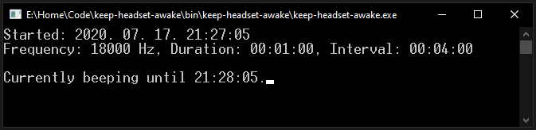

# keep-headset-awake

Keeps a wireless headset awake by periodically playing sounds inaudible to the human ear.  
I made this because my HyperX Cloud Flight headset automatically turns off after ~15 minutes of inactivity.

## Usage

- Ensure that .NET Core 3.1 Runtime is installed.
- Download and unzip the binaries from [the latest release](https://github.com/sanraith/keep-headset-awake/releases/latest).
- Edit `appsettings.json` to customize the beep length, frequency and interval.
- Run `keep-headset-awake.exe`.  
If you want to hide the a console, run `keep-headset-awake-NOCONSOLE.exe` instead.

## Build from source

- Ensure that .NET Core 3.1 SDK is installed.
- Clone the repo with `git clone https://github.com/sanraith/keep-headset-awake.git`
- Run `publish.bat` from the project directory.  
The binaries are placed into `bin\keep-headset-awake\`
